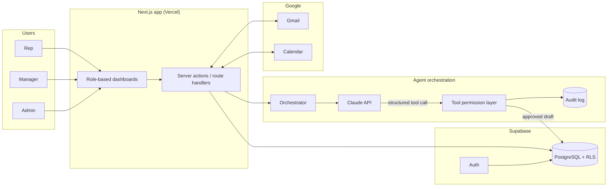

# CoAgency — Case Study

**A multi-role AI CRM that turns sales conversations into CRM actions, with a human approving every step.**

> Designed and built by **Ambrose Tsai** — enterprise SaaS commercial leader, Taipei.
> This repository is a public case study. **The product source code is private.**
> All names, companies, and figures in screenshots are fictional demo data.

---

## The 3-minute version

| | |
|---|---|
| **Problem** | Sales reps don't update the CRM, so managers forecast from incomplete data and follow-ups fall through the cracks. |
| **Insight** | The CRM is empty because data entry happens *after* the real work. AI should do the entry, and the rep should only approve it. |
| **What I built** | A multi-tenant web app with three roles (Rep, Manager, Admin) and four AI agents: **AI Record, Follow-up, Deal Coach, Message Agent**. |
| **Key design rule** | Human-in-the-loop by default. Agents *suggest* or *draft*; a person confirms before anything is written to the CRM or sent to a customer. |
| **Stack** | Next.js (App Router) · React · TypeScript · Supabase (PostgreSQL, Auth, RLS, Storage) · Anthropic Claude API · Gmail / Google Calendar APIs · Vercel |
| **Result** | Colleagues using it internally said creating a new opportunity went from **about 30 minutes to about 5 minutes**. |
| **My role** | Product owner and builder: problem framing, product spec, UX direction, data model, security decisions, release gates. I built it with AI coding agents. |

---

## Why this project exists

I've spent my career on the commercial side of enterprise SaaS: sales, partnerships, pricing, and RevOps. The same problem kept showing up in every team I managed:

- Reps treat the CRM as admin work, so it's always out of date.
- Managers can't see the real pipeline, and reps are usually too optimistic about their deals.
- Follow-up breaks down between quoting and contract.
- Managers don't have enough context to coach.

Most "AI CRM" features are a smarter input form. I wanted to test a different idea: **the rep talks, the AI records, the rep approves, and the manager sees the result right away.**

---

## What's inside this case study

| Doc | What it covers |
|---|---|
| [01 · Problem & approach](docs/01-problem-and-approach.md) | The sales-process breakpoints, and why each agent sits where it does |
| [02 · Roles & workflows](docs/02-roles-and-workflows.md) | Rep, Manager, and Admin experiences; Gmail, Calendar, and CRM flows |
| [03 · Agent design](docs/03-agent-design.md) | AI Record, Follow-up, Deal Coach, and Message Agent; Suggest / Draft / Autopilot modes |
| [04 · Architecture](docs/04-architecture.md) | System diagram, agent orchestration, tool permission layer, audit log |
| [05 · Security & RBAC](docs/05-security-and-rbac.md) | Tenant isolation, role-based access, and three real hardening cases |
| [06 · How it was built](docs/06-delivery-process.md) | AI-assisted delivery, sprint gates, and the testing discipline behind it |
| [07 · Results & limits](docs/07-results-and-limitations.md) | What I can claim, what I can't, and what I learned |
| [Screenshots](screenshots/) | De-identified product screens (demo data only) |

---

## Architecture at a glance

Every AI action goes through the same path: **read CRM context, call the model, check permissions, create a draft, get human approval, write the result, record it in the audit log.**

---

## What I'm deliberately *not* claiming

- CoAgency is **not** a publicly launched or commercially sold SaaS product.
- It has **no paying customers**, and I don't report ROI multiples.
- It does **not** fully automate the CRM. Autonomous modes are designed but kept off, and a person approves every external action.
- The time-saving figure comes from colleagues' feedback during internal use, not from a controlled study.

---

## Contact

**Ambrose Tsai** · Taipei · [moralen28@gmail.com](mailto:moralen28@gmail.com)

I'm happy to walk through a live demo of the private build in an interview.

© 2026 Ambrose Tsai. Case-study content only. The CoAgency source code is proprietary and not included.
