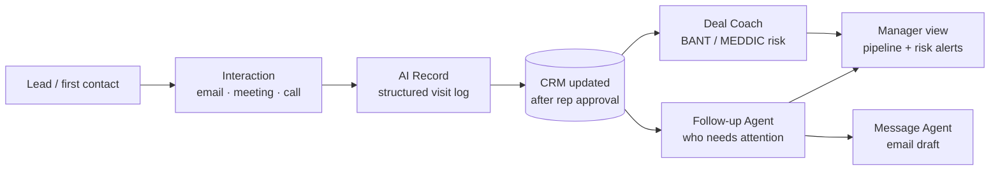

# 01 · Problem & Approach

## The sales-process breakpoints

These come from years of running B2B SaaS sales teams, not from a market survey.

| Breakpoint | What goes wrong | Business impact |
|---|---|---|
| After first contact or a meeting | Reps don't write the visit log, or write one line | CRM data is incomplete; nobody else can pick up the account |
| Opportunity creation | Setting up a new deal takes many fields and a lot of context-switching | Deals get created late or not at all, so the pipeline is understated |
| Opportunity assessment | Reps overestimate their deals | Forecasts miss; managers find out too late |
| After quoting, before contract | Nobody owns the next follow-up | Deals go cold without anyone noticing |
| Manager review | Managers only see stage and amount, not the story | Coaching is based on gut feel, and managers can't judge better than their reps |
| After closing | Handoff to CS/AM is scattered across chats and email | The customer repeats themselves; onboarding slips |

## Core thesis

> The CRM is empty because data entry happens *after* the real work.
> Put the AI at each breakpoint, let it do the entry, and make the human's job **approve, edit, or dismiss**.

This leads to three product principles:

1. **Capture from what already exists.** Typed notes, meeting transcripts, email threads, and calendar events. Don't add new forms.
2. **Draft, don't decide.** The AI proposes, and a person confirms. Trust is earned one approved draft at a time.
3. **Managers see more than reps.** The manager view pulls together risk signals (stale deals, slowing replies, a thin pipeline) that no single rep can see.

## Where each agent sits

## Scope decision: start narrow

The platform vision covers every team that touches the customer (sales, CS, finance, legal, ops). The MVP covers **only the sales loop**, because:

- It's the loop I know best and could test with real users right away.
- It has the clearest before/after measure: time to create and update an opportunity.
- If reps won't trust AI drafts for their own deals, they won't trust them anywhere else.
