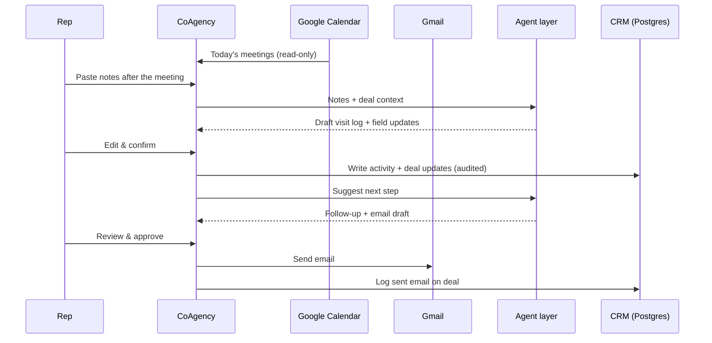

# 02 · Roles & Workflows

CoAgency has three tenant roles. Each role gets a different default view, not just different permissions.

## Rep: "tell me what to do today"

| Surface | Purpose |
|---|---|
| **Today** | Due and overdue follow-ups, today's meetings from Google Calendar, and pending AI drafts |
| **Pending AI drafts** | Visit records, follow-up suggestions, deal-coach notes, and email drafts, each with *Confirm / Edit / Dismiss* |
| **Deals / Accounts / Contacts** | Standard CRM records, kept up to date through approved drafts |
| **Inbox** | Gmail threads linked to deals, used as context for the agents |

**Typical loop (about 5 minutes instead of about 30):**

1. The rep pastes meeting notes, or picks a calendar meeting or email thread.
2. **AI Record** drafts a structured visit log and the deal-field updates it suggests.
3. The rep edits a sentence if needed and clicks **Confirm & save**.
4. **Follow-up Agent** proposes the next step, and **Message Agent** turns it into an email draft.
5. The rep reviews the email and sends it.

## Manager: "where is the pipeline really?"

| Surface | Purpose |
|---|---|
| **Manager dashboard** | Pipeline by rep and stage, weighted forecast, and quota comparison |
| **Risk alerts** | Rep hasn't updated the CRM in N days · customer replies slowing · high-value deal stalled · rep's pipeline too thin |
| **Deal Coach output** | BANT / MEDDIC gaps per deal, used as a coaching agenda |
| **Audit trail** | Which agent read what, what it proposed, and who approved it |

## Admin: "configure it safely"

| Surface | Purpose |
|---|---|
| **Users & roles** | Invite users, assign Rep / Manager / Admin, reassign deal ownership |
| **Integrations** | Connect or disconnect Gmail and Google Calendar per user |
| **Pipeline settings** | Tenant-specific stages, probabilities, and required fields |
| **Import / export** | CSV import with dedupe; exports that are audited and fail closed |

## Integration workflows

**Integration principles**

- Access is the minimum each step needs. Calendar is read-only for events. Gmail access is scoped to what the workflow uses.
- OAuth tokens are encrypted at rest and stored per user, never shared across the tenant.
- Nothing is sent to a customer without the rep's explicit approval.
