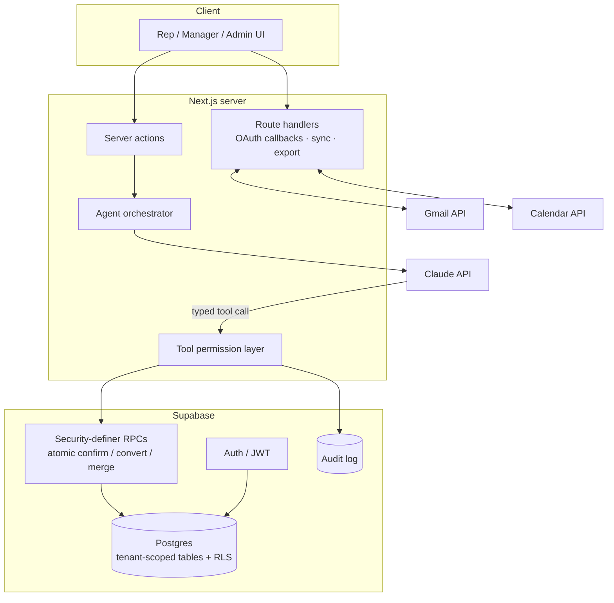
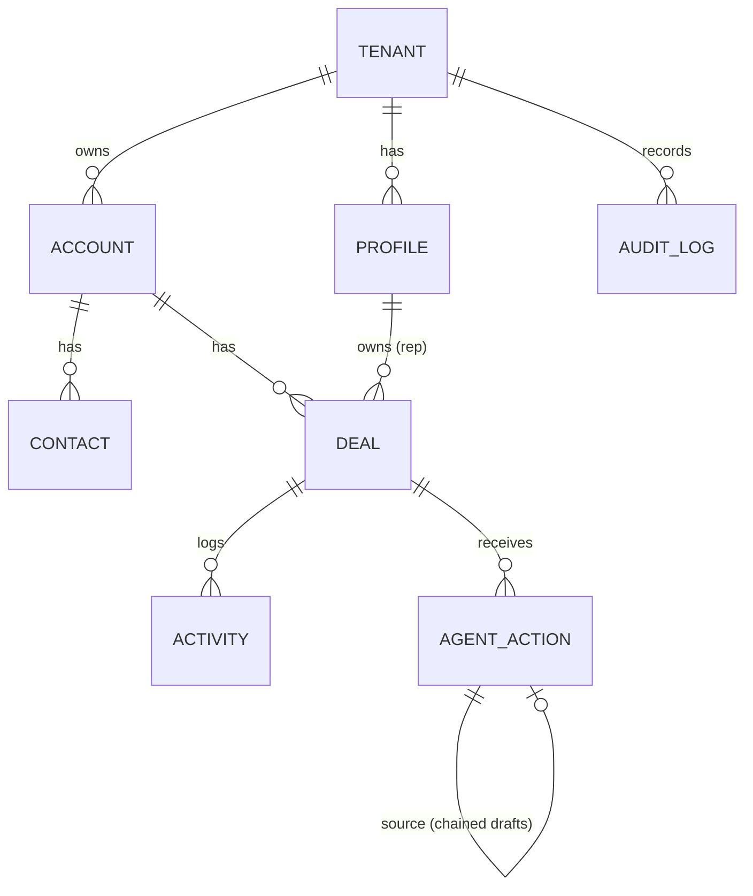

# 04 · Architecture

## Stack

| Layer | Choice | Why |
|---|---|---|
| Frontend | Next.js App Router, React, TypeScript, Tailwind | Fast iteration; server components keep secrets on the server |
| Backend | Next.js server actions and route handlers | One codebase, one deploy |
| Database | Supabase PostgreSQL | Relational CRM data with Row Level Security for multi-tenancy |
| Auth | Supabase Auth | JWT sessions tied to database policies |
| AI | Anthropic Claude API | Structured tool use for agent outputs |
| Integrations | Gmail API, Google Calendar API | Where sales work already happens |
| i18n | next-intl | Built for multiple languages from day one |
| Hosting | Vercel + Supabase | No infrastructure to run as a one-person team |
| Quality | Vitest, pgTAP, ESLint, axe-core | App tests, database tests, and accessibility checks |

## System diagram



## Agent execution path

```
Trigger (user action · scheduled job · system event)
  → Orchestrator selects agent + loads tenant-scoped CRM context
  → Claude API called with tool definitions
  → Model returns a structured tool call (schema-validated)
  → Tool permission layer checks agent × mode × tenant × role
  → Draft stored as a pending agent action
  → Human confirms / edits / dismisses
  → Atomic RPC writes CRM changes
  → Audit record written
```

## Data model (simplified)



Every business table carries a `tenant_id`, and database policies (not only application code) enforce tenant isolation.

## Key design decisions

| Decision | Alternative considered | Reasoning |
|---|---|---|
| Enforce tenancy in the database (RLS) | Filter in application code | A missed `WHERE` clause shouldn't be able to leak another customer's data |
| Critical writes as atomic RPCs | Several client calls | "Confirm draft + update deal + write audit" must all succeed or all fail |
| Draft-first agents | Direct autonomous writes | Trust and correctness matter more than saving one click |
| Start with the minimum Google access | Request full mailbox access up front | Easier OAuth review; less risk for users |
| Numbered, replayable migrations with CI | Manual schema edits | Every environment can be rebuilt and tested from zero |
